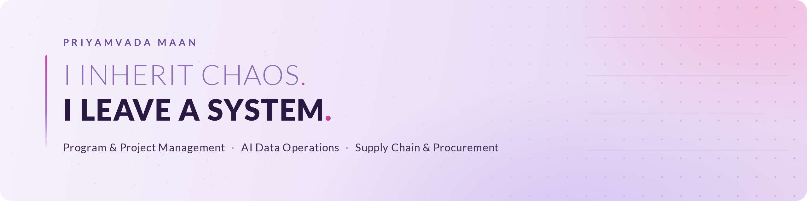
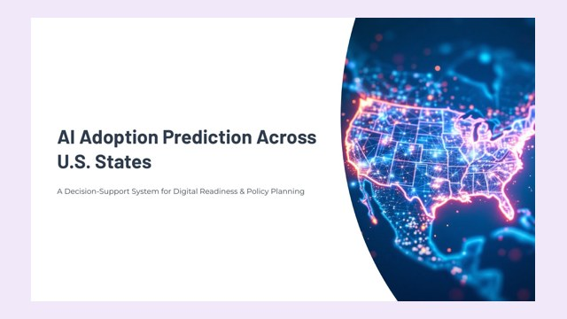
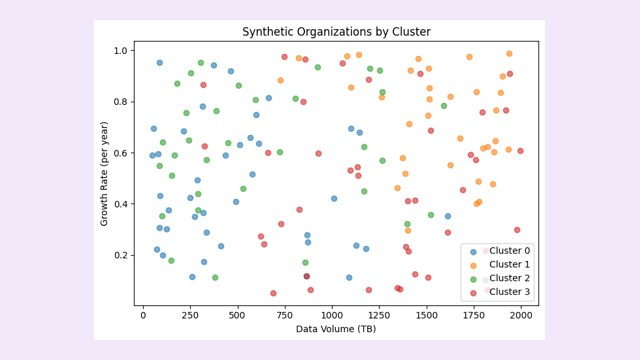
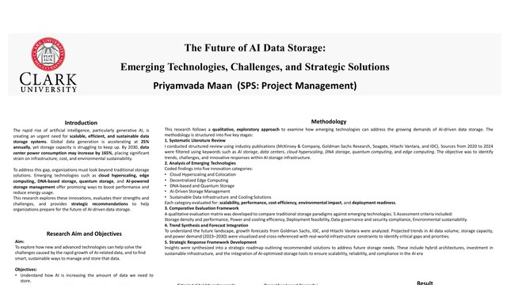

  

  
  
  

## About me

I'm a program and project manager who works where AI, data and operations meet. My pattern is simple: I walk into a gap, and I build the system that wasn't there.

- **Where I've done it:** delivering LLM and NLP training data for Google through Tech Mahindra, building KeelWorks Foundation's first Data Services function, and running suppliers and procurement in industrial supply chain
- **What I build:** quality systems, operating rhythms and data foundations that keep running after I hand them off
- **Why I write code:** I build machine learning prototypes myself, so I understand the systems I manage from data to deployment to governance
- **Where I am:** Bay Area, CA, open to roles across USA and remote in the US

## Featured projects

<table>
  <tr>
    <td width="300" valign="top">
      
    </td>
    <td valign="top">
      <h3><a href="https://github.com/PriyamvadaMaan/ai-adoption-prediction">AI Adoption Prediction Across U.S. States</a></h3>
      A decision-support model that scores AI readiness for all 50 states and tests which investments move it most.
      <ul>
        <li>Compared Logistic Regression, Random Forest and XGBoost in scikit-learn pipelines with automated data tests</li>
        <li>Ran what-if scenarios, such as raising broadband access by 5% in every state</li>
        <li>Delivered in three Agile sprints, with deployment design, a monitoring plan, RACI, risk register and model card</li>
      </ul>
      <b>Python · scikit-learn · XGBoost · Model governance</b>
    </td>
  </tr>
  <tr>
    <td width="300" valign="top">
      
    </td>
    <td valign="top">
      <h3><a href="https://github.com/PriyamvadaMaan/farsight">FARSIGHT: AI Storage Strategy Assistant</a></h3>
      Recommends a data storage strategy for an organization's AI workloads and explains every recommendation in plain language.
      <ul>
        <li>Combines a transparent rule engine, K-Means clustering and TF-IDF retrieval</li>
        <li>Interactive interface that generates a strategy report on click</li>
        <li>Stress-tested on 300 synthetic profiles to confirm each rule behaves as designed</li>
      </ul>
      <b>Python · K-Means · TF-IDF · ipywidgets · Explainability</b>
    </td>
  </tr>
  <tr>
    <td width="300" valign="top">
      
    </td>
    <td valign="top">
      <h3><a href="https://github.com/PriyamvadaMaan/ai-data-storage-research">The Future of AI Data Storage</a></h3>
      Research presented at Clark University's Graduate Student Multi-Disciplinary Conference, April 2025.
      <ul>
        <li>Reviewed industry research from McKinsey, Goldman Sachs, IDC, Seagate and Hitachi Vantara</li>
        <li>Compared emerging storage technologies on five criteria, from density to governance</li>
        <li>Recommended a hybrid strategy, then built FARSIGHT to make it practical</li>
      </ul>
      <b>Research design · Technology evaluation · Data governance</b>
    </td>
  </tr>
</table>

## How I work

1. **Design quality in, don't inspect it in.** Rubrics, gold sets and calibration come before scale.
2. **Fix the flow before adding people.** Most capacity problems are really utilization and rework problems.
3. **Make every decision traceable.** RACI charts, risk registers and model cards turn judgment into something others can check.
4. **Leave a system, not a dependency.** If the work stops when I leave, the job isn't finished.

## Case study: LLM training data for Google

<b>How I ran AI data delivery at scale (click to expand)</b>

 

**Context.** As Senior Associate, Program Management at Tech Mahindra (2021–2024), I ran delivery of LLM and NLP training data for a four-project Google AI/ML portfolio across 19 European language markets.

**What I built**
- A quality system: annotation schemas, labeling guidelines, scoring rubrics, sampling audits, inter-annotator agreement and gold-set calibration
- Demand-based workforce planning to match staffing to incoming work
- An onboarding and training path that brought new annotators to full output within 30 days
- Program governance with Google executive stakeholders: delivery and quality reporting, with risks and issues driven to resolution

**What it delivered**

| Result | |
|---|---|
| Client-audited data accuracy | **99%** |
| Rework rate | **15% → under 5%** |
| Team utilization | **65% → 76%** |
| Client escalations | **−27%** |
| Annotators trained and led | **200+** |
| Pilots taken to full production | **2, at 100% SLA attainment** |

## Toolkit

  
  
  
  
  
  
  
  
  

**Methods:** Agile · Scrum · Kanban · Lean Six Sigma Green Belt · LLM evaluation · Data governance · Vendor and SLA management

## Education

**M.S. Project Management**, Clark University (2025), GPA 3.88, STEM-designated, PMI GAC-accredited 
**B.Tech Computer Science & Engineering**, Kurukshetra University

---

  Hiring for program, project or AI data operations roles? <a href="https://www.linkedin.com/in/priyamvadamaan">Let's talk on LinkedIn</a>.

